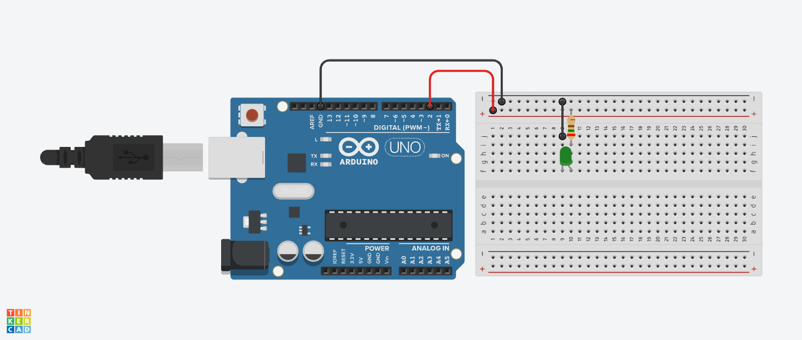
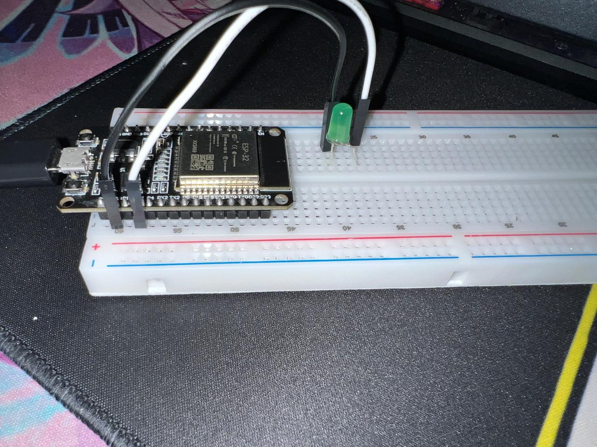

# Actividad 2 — LED con entrada analógica (ESP32)

Este fichero describe el sketch `actividad2.ino` que realiza lecturas analógicas en una entrada ADC del ESP32 y controla la intensidad de un LED mediante PWM.

## Archivos
- `actividad2.ino` — Sketch principal (ESP32) que lee el ADC y aplica PWM al LED (usa la API LEDC o `analogWrite` si el core lo soporta).

## Descripción del código
El programa realiza lo siguiente:

1. Define pines y parámetros ADC/PWM:

   - `analogPin` — Pin ADC (por ejemplo, GPIO34)
   - `ledPin` — Pin de salida para el LED (por ejemplo, GPIO2)
   - `adcResolutionBits` — Resolución ADC (típicamente 12 bits en ESP32)
   - `vRef` — Voltaje de referencia aproximado (3.3V)
   - `attenuation` — Atenuación ADC (p. ej. `ADC_11db`) para medir hasta ~3.3V
   - PWM: canal, frecuencia y resolución (usando LEDC)

2. En `setup()` se inicializa el Serial, se configura la resolución y atenuación del ADC y se configura el canal PWM (`ledcSetup`/`ledcAttachPin`) o se usa `analogWrite` cuando esté disponible.

3. En `loop()` se lee el valor bruto del ADC (`analogRead`), se calcula un voltaje aproximado y se convierte ese valor a un duty PWM proporcional. El duty se escribe con `ledcWrite` (o `analogWrite` si se prefiere). También se imprime el valor por el puerto serie.

## Conexión (hardware)
- Señal analógica (p.ej. potenciómetro): una pata a 3.3V, una a GND y la salida al pin `analogPin`.
- LED → resistencia (220Ω) → `ledPin` (o conecta el LED directamente a `ledPin` si tu placa lo soporta).
- GND común con el ESP32.

# Actividad 2 — LED con PWM (entrada analógica opcional) para ESP32

Este README se basa en el contenido de `actividad2.ino` y sigue la estructura del README de la Actividad 1. El sketch controla un LED mediante PWM usando la API LEDC del ESP32.

## Archivos
- `actividad2.ino` — Sketch mínimo que configura PWM en un pin y escribe un duty fijo (muestra de uso de LEDC).

## Contenido del sketch (base)
El código base en `actividad2.ino` es el siguiente (resumen):

```cpp
// Pin del LED (conecta el ánodo del LED + resistencia al pin, cátodo a GND)
const int ledPin = 2;

// Parámetros PWM (LEDC)
const int freq = 5000;       // Frecuencia PWM en Hz (5-5000Hz)
const int resolution = 8;    // Resolución en bits (8 bits -> 0..255 , 9 bits -> 0..511)

void setup() {
   // Asocia el pin al PWM configurando automáticamente frecuencia y resolución
   ledcAttach(ledPin, freq, resolution);
}

void loop() {
   // 128 representa un 50% de duty cycle o brillo medio en un Led.
   ledcWrite(ledPin, 128);
}
```

> Nota: El sketch anterior es el que proporcionaste; más abajo explicamos cada parámetro y la forma correcta recomendada de usar LEDC.

## Explicación detallada de parámetros PWM

- Frecuencia (`freq`):
   - La frecuencia PWM es cuántas veces por segundo se repite el ciclo ON/OFF. En el sketch se usa `5000` Hz (5 kHz).
   - Rangos típicos: 500 Hz - 10 kHz para LEDs está bien; para motores o filtros PWM muy bajos pueden usarse frecuencias menores.
   - Frecuencias más altas reducen parpadeo visible y ruido audiblemente, pero pueden aumentar la interferencia EMI y consumo.

- Resolución (`resolution`):
   - Representa cuántos pasos tiene el duty cycle: por ejemplo, 8 bits → 256 pasos (0..255). 9 bits → 512 pasos (0..511).
   - Elección práctica: 8 bits es simple y suficiente para muchos usos; sube a 10 o 12 bits cuando necesites más suavidad en cambios de intensidad.
   - En ESP32 la resolución que configures afecta el rango de valores que `ledcWrite` acepta.

- Duty cycle (valor que escribe `ledcWrite`):
   - En resolución de 8 bits, `ledcWrite(..., 128)` equivale a ~50% (128/255 ≈ 0.502).
   - Cambia el valor para ajustar brillo: 0 = apagado, max = brillo máximo (por ejemplo, 255 con 8 bits).

## Nota sobre la API LEDC y la forma recomendada

El snippet original usa `ledcAttach(ledPin, freq, resolution)` que no es la forma estándar más extendida en ejemplos del core ESP32. La forma recomendada y explícita es:

```cpp
ledcSetup(channel, freq, resolution);
ledcAttachPin(ledPin, channel);
ledcWrite(channel, duty);
```

Esto te da control sobre el `channel` (canal) que usa el hardware PWM interno del ESP32. Muchos wrappers del core pueden ofrecer funciones simplificadas que configuran un canal automáticamente al llamar `analogWrite` o similar, pero declarar el canal te permite:

- Reusar canales entre pines si quieres compartir configuración.
- Controlar la frecuencia y resolución de forma reproducible.
- Evitar colisiones si tu sketch usa varios PWMs.

## Conexión (hardware)

- LED externo: Conecta el ánodo del LED al pin `ledPin` a través de una resistencia (~220Ω). Conecta el cátodo a GND.
- GND común: Asegúrate de que el GND del ESP32 esté conectado a la tierra del circuito.

> Nota: Algunos módulos ESP32 traen un LED integrado en GPIO2; si usas ese pin podrías ver el efecto sin conectar nada.

## Diagrama de conexión

Coloca aquí la imagen del diagrama Tinkercad y el enlace:

- 
- Enlace a Tinkercad: https://www.tinkercad.com/things/2nKtMK5MIPY-1leddigital?sharecode=pX9LFTpKYWoREUY1aIF6_ApNUSlEYM1kqun8cxmG2XQ

## Foto del montaje real

Coloca aquí una foto del ESP32 conectado en el mundo real:

- 

## Cómo subir el sketch

1. Abre Arduino IDE.
2. Selecciona la placa ESP32 (por ejemplo: "ESP32 Dev Module").
3. Selecciona el puerto serie correcto.
4. Haz clic en "Subir".