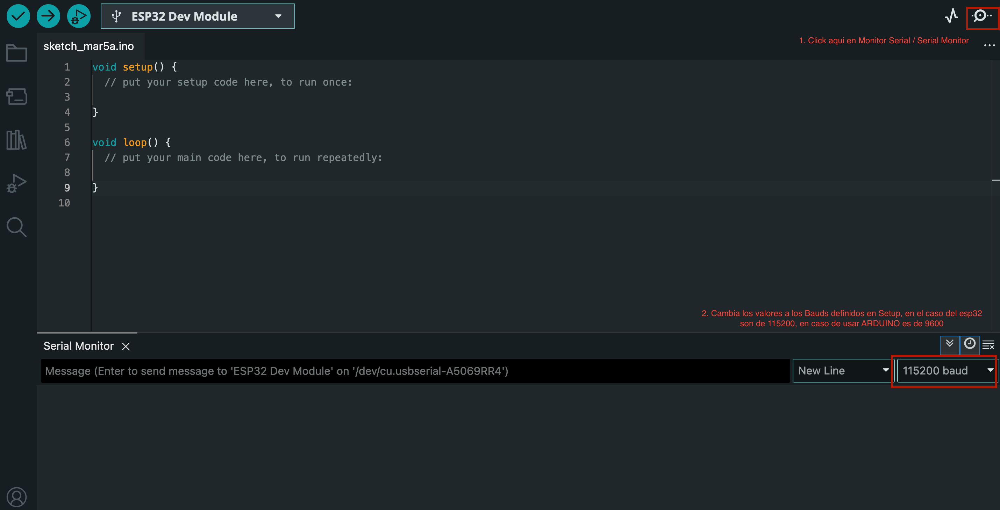

# Actividad 3 — LED con Monitor Serial (ESP32)

Este repositorio contiene un sketch sencillo para ESP32 que utiliza el monitor serial para ajustar el brillo de un LED mediante PWM.

## Archivos
- `actividad3.ino` — Sketch principal (ESP32) que interactúa con el monitor serial y controla el brillo de un LED conectado a GPIO2.

## Descripción del código
El programa hace lo siguiente:

1. Define el pin donde está conectado el LED y los parámetros PWM:

   ```cpp
   const int ledPin = 2;
   const int freq = 5000;       // Frecuencia PWM en Hz (5-5000Hz)
   const int resolution = 8;    // Resolución en bits (8 bits -> 0..255)
   ```

2. En `setup()` inicializa el pin, configura la comunicación serial y asocia el pin al PWM:

   ```cpp
   Serial.begin(115200);
   ledcAttach(ledPin, freq, resolution);
   Serial.println("Ingresa un valor de brillo entre 0 y 255:");
   ```

   - La función `Serial.begin(115200)` establece la velocidad de comunicación con el monitor serial a 115200 baudios.
   - El mensaje inicial se envía al monitor serial para indicar al usuario que puede ingresar valores de brillo.
   - Importante tener estos valores definidos en el IDE en el monitor serial también:
   

3. En `loop()` lee valores desde el monitor serial y ajusta el brillo del LED:

   ```cpp
   if (Serial.available()) {
       String input = Serial.readStringUntil('\n');
       input.trim();
       int brillo = input.toInt();
       if (brillo >= 0 && brillo <= 255) {
           ledcWrite(ledPin, brillo);
           Serial.print("Brillo ajustado a: ");
           Serial.println(brillo);
       } else {
           Serial.println("Valor invalido. Usa un numero entre 0 y 255.");
       }
   }
   ```

   - `Serial.available()` verifica si hay datos disponibles en el monitor serial.
   - `Serial.readStringUntil('\n')` lee la línea completa ingresada por el usuario hasta encontrar un salto de línea.
   - El valor ingresado se convierte a un número entero y se valida que esté en el rango de 0 a 255.
   - Si el valor es válido, se ajusta el brillo del LED usando `ledcWrite` y se envía un mensaje de confirmación al monitor serial.
   - Si el valor no es válido, se envía un mensaje de error al monitor serial.

## Conexión (hardware)
- LED → resistor de 220Ω (Opcional) → GPIO2 (o el pin que hayas configurado)
- LED cathode → GND
- ESP32 alimentado según tu módulo (usa 5V o 3.3V según corresponda)

> Nota: algunos módulos ESP32 ya tienen un LED integrado en GPIO2, por lo que podrías ver el comportamiento sin conectar un LED externo.

## Diagrama de conexión
Imagen del diagrama de Tinkercad y el enlace al proyecto en Tinkercad:

- 
- Enlace a Tinkercad: https://www.tinkercad.com/things/3nKtMK5MIPY-3ledmonitorserial?sharecode=pX9LFTpKYWoREUY1aIF6_ApNUSlEYM1kqun8cxmG2XQ

## Foto del montaje real

- 

## Cómo subir el sketch
1. Abre Arduino IDE.
2. Selecciona la placa ESP32 (por ejemplo: "ESP32 Dev Module").
3. Selecciona el puerto serie correcto.
4. Haz clic en "Subir".