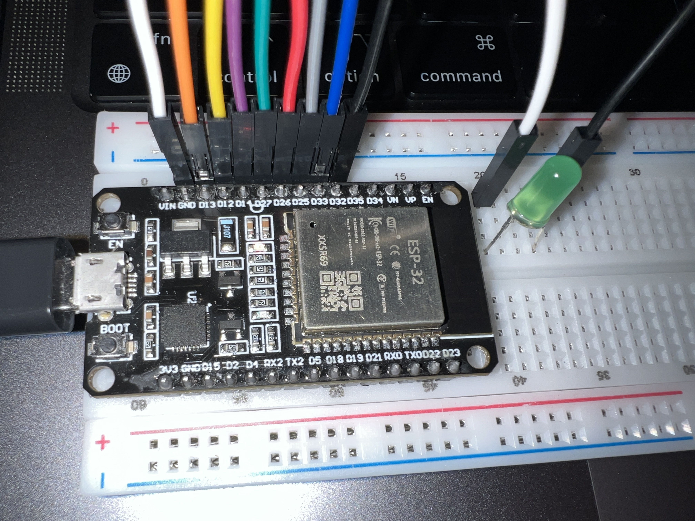

# Actividad 4 — LED con Teclado Matricial (ESP32)

Este repositorio contiene un sketch sencillo para ESP32 que utiliza un teclado matricial para controlar el estado de un LED.

## Archivos
- `actividad4.ino` — Sketch principal (ESP32) que interactúa con un teclado matricial y controla un LED conectado a GPIO2.

## Descripción del código
El programa hace lo siguiente:

1. Configura las conexiones del teclado matricial y el pin del LED:

   ```cpp
   const int ledPin = 2; // Pin del LED
   // Configuración de pines del teclado matricial
   const byte filas = 4; // Número de filas
   const byte columnas = 4; // Número de columnas
   char teclas[filas][columnas] = {
       {'1', '2', '3', 'A'},
       {'4', '5', '6', 'B'},
       {'7', '8', '9', 'C'},
       {'*', '0', '#', 'D'}
   };
   byte pinesFilas[filas] = {25, 26, 27, 14};
   byte pinesColumnas[columnas] = {12, 13, 32, 33};
   ```

2. En `setup()` inicializa el pin del LED como salida y configura el teclado matricial:

   ```cpp
   pinMode(ledPin, OUTPUT);
   digitalWrite(ledPin, LOW);
   // Inicialización del teclado matricial
   Keypad teclado = Keypad(makeKeymap(teclas), pinesFilas, pinesColumnas, filas, columnas);
   ```

3. En `loop()` detecta las teclas presionadas y realiza acciones específicas.

   - El programa utiliza la biblioteca `Keypad` para detectar las teclas presionadas.

## Conexión (hardware)
- LED → resistor de 220Ω (Opcional) → GPIO2 (o el pin que hayas configurado)
- LED cathode → GND
- Pines del teclado matricial conectados a los pines especificados en el código.
- ESP32 alimentado según tu módulo (usa 5V o 3.3V según corresponda).

> Nota: algunos módulos ESP32 ya tienen un LED integrado en GPIO2, por lo que podrías ver el comportamiento sin conectar un LED externo.

## Foto del montaje real

- 

## Cómo subir el sketch
1. Abre Arduino IDE.
2. Selecciona la placa ESP32 (por ejemplo: "ESP32 Dev Module").
3. Selecciona el puerto serie correcto.
4. Haz clic en "Subir".