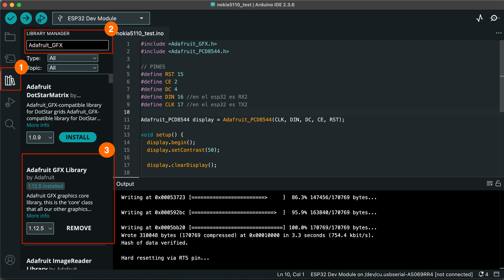
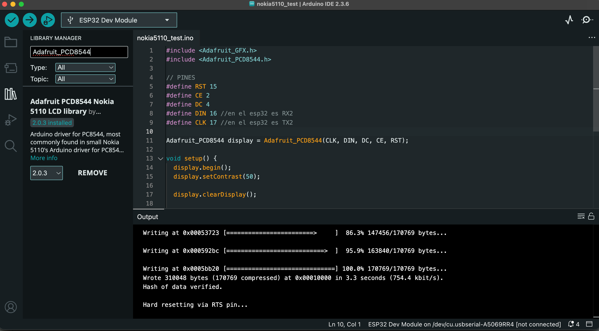
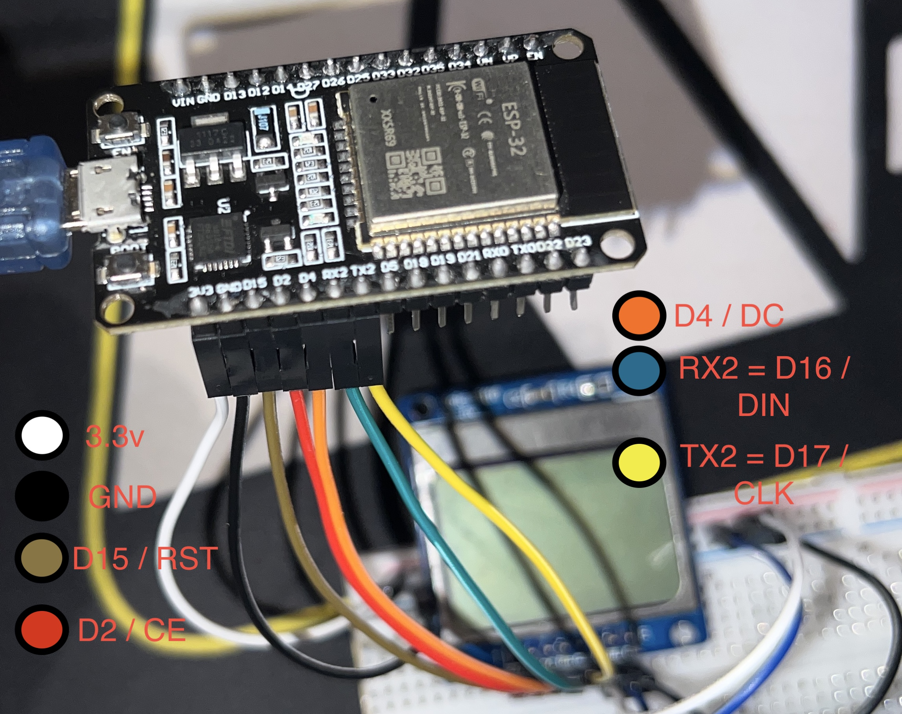
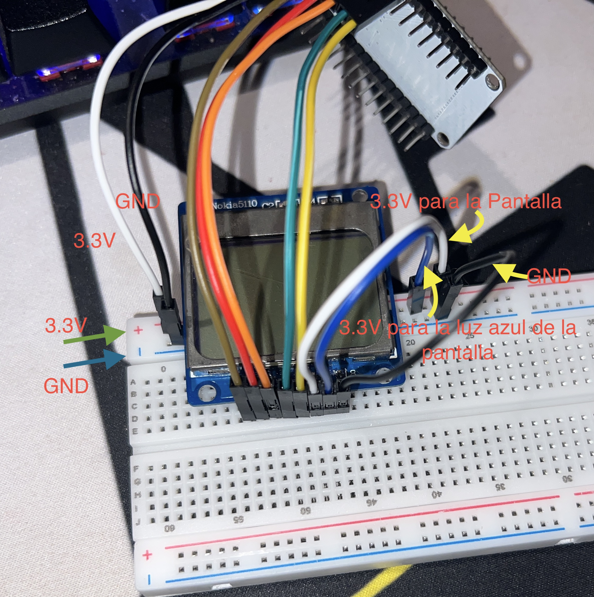

# Practica 2 — Pantalla LCD Nokia 5110 (ESP32)

Este repositorio contiene un sketch para ESP32 que muestra texto en una pantalla LCD Nokia 5110 utilizando la librería Adafruit_PCD8544.

## Archivos
- `actividad1.ino` — Sketch principal (ESP32) que inicializa la pantalla y muestra el texto "HOLA" y "MUNDO".

## Descripción del código
El programa realiza lo siguiente:

1. Incluye las librerías necesarias:
   ```cpp
   #include <Adafruit_GFX.h>
   #include <Adafruit_PCD8544.h>
   ```

- 

- 

2. Define los pines de conexión entre el ESP32 y la pantalla LCD:
   ```cpp
   #define RST 15
   #define CE 2
   #define DC 4
   #define DIN 16 // RX2 en ESP32
   #define CLK 17 // TX2 en ESP32
   ```

3. Inicializa el objeto display:
   ```cpp
   Adafruit_PCD8544 display = Adafruit_PCD8544(CLK, DIN, DC, CE, RST);
   ```

4. En `setup()`:
   - Inicializa la pantalla y ajusta el contraste.
   - Borra la pantalla.
   - Configura el tamaño y color del texto.
   - Establece la posición del cursor y muestra "HOLA" y "MUNDO".
   - Actualiza la pantalla para mostrar el contenido.

   ```cpp
   display.begin();
   display.setContrast(50);
   display.clearDisplay();
   display.setTextSize(2);
   display.setTextColor(BLACK);
   display.setCursor(0,0);
   display.println("HOLA");
   display.setCursor(24, 24);
   display.println("MUNDO");
   display.display();
   ```

5. El `loop()` está vacío porque la pantalla solo muestra el mensaje una vez al inicio.

## Conexión (hardware)
- Pantalla LCD Nokia 5110 conectada a los pines especificados en el código.
- ESP32 alimentado a 3.3

## Foto del montaje real
- 

- 

## Cómo subir el sketch
1. Abre Arduino IDE.
2. Selecciona la placa ESP32 (por ejemplo: "ESP32 Dev Module").
3. Selecciona el puerto serie correcto.
4. Haz clic en "Subir".