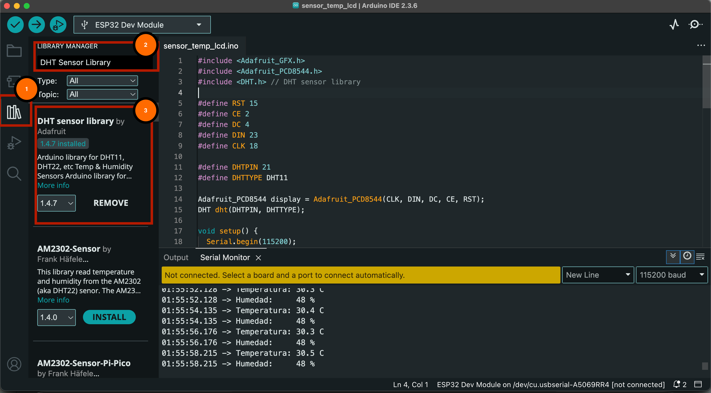
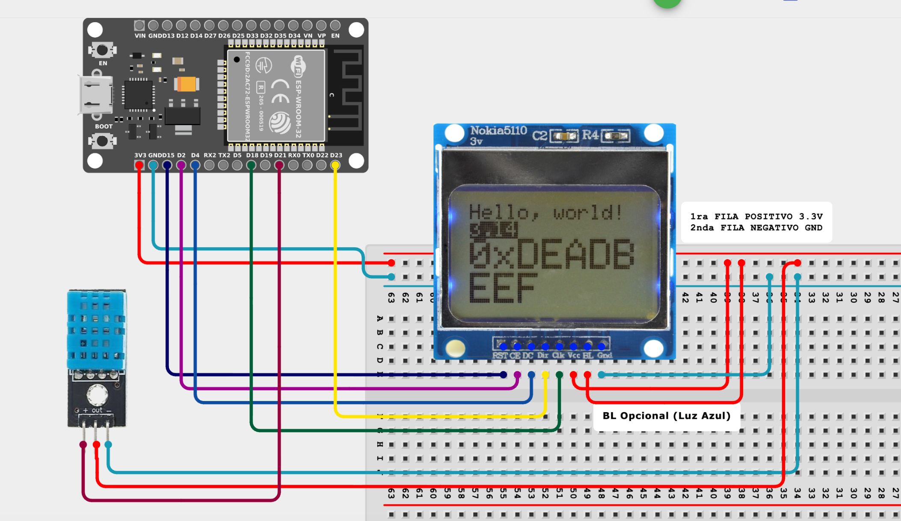
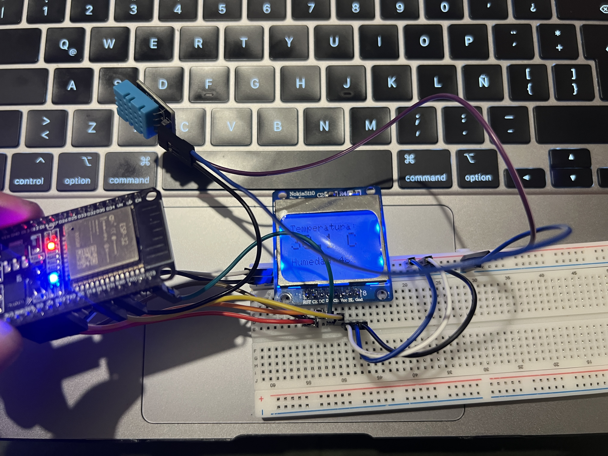
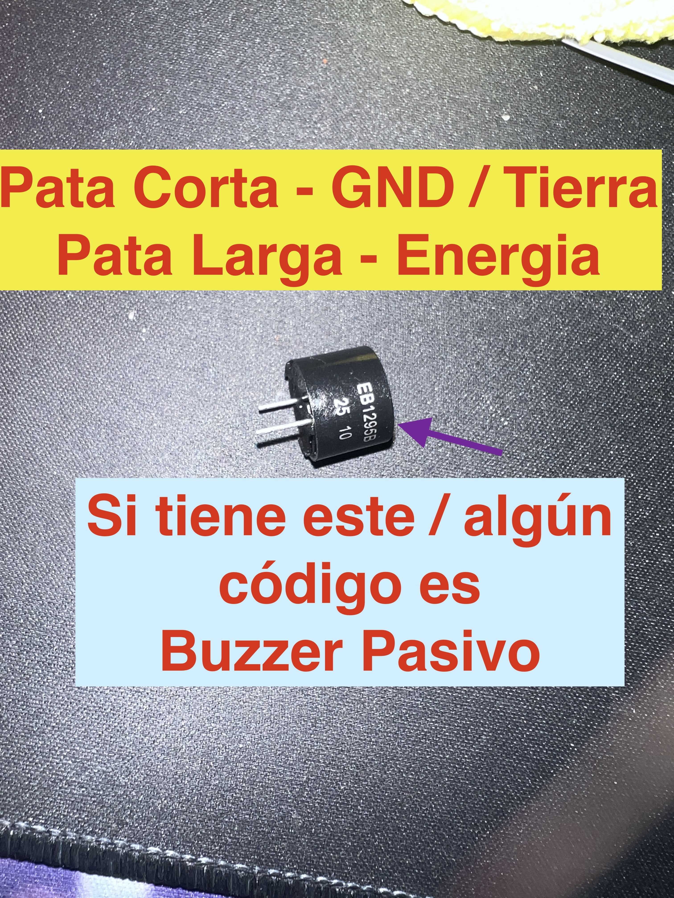
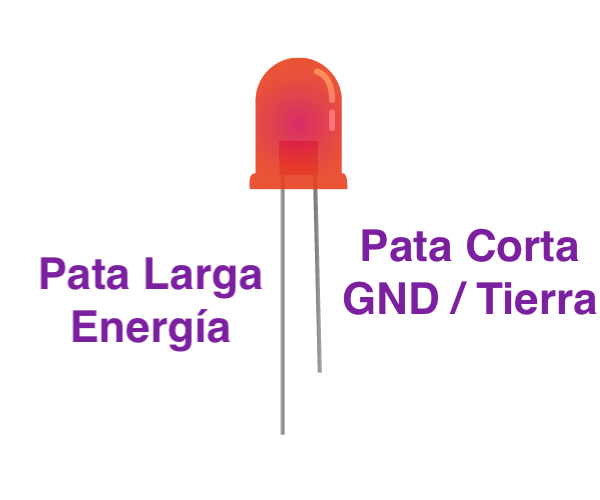

# Practica 2 — Sensor de Temperatura y Humedad con Pantalla LCD (ESP32)

Este repositorio contiene un sketch para ESP32 que muestra la temperatura y humedad del ambiente usando un sensor DHT11 y una pantalla LCD Nokia 5110.

## Archivos
- `actividad2.ino` — Sketch principal (ESP32) que inicializa la pantalla, lee el sensor DHT11 y muestra los valores en pantalla.

## Descripción del código
El programa realiza lo siguiente:

1. Incluye las librerías necesarias:
   ```cpp
   #include <Adafruit_GFX.h>
   #include <Adafruit_PCD8544.h>
   #include <DHT.h>
   ```

- 

2. Define los pines de conexión entre el ESP32, la pantalla LCD y el sensor DHT11:
   ```cpp
   #define RST 15
   #define CE 2
   #define DC 4
   #define DIN 23
   #define CLK 18
   #define DHTPIN 21
   #define DHTTYPE DHT11
   ```

3. Inicializa los objetos display y sensor:
   ```cpp
   Adafruit_PCD8544 display = Adafruit_PCD8544(CLK, DIN, DC, CE, RST);
   DHT dht(DHTPIN, DHTTYPE);
   ```

4. En `setup()`:
   - Inicializa la pantalla LCD y el sensor DHT11.
   - Muestra un mensaje de inicio.

5. En `loop()`:
   - Lee la temperatura y humedad del sensor DHT11.
   - Si hay error de lectura, muestra mensaje de error.
   - Si la lectura es correcta, muestra los valores en la pantalla LCD y por el monitor serial.

   ```cpp
   float temp = dht.readTemperature();
   float hum  = dht.readHumidity();
   // ...
   display.print(temp, 1);
   display.print(hum, 0);
   ```

## Conexión (hardware)
- Pantalla LCD Nokia 5110 conectada a los pines especificados en el código.
- Sensor DHT11 conectado al pin 21.
- ESP32 alimentado a 3.3V.

## Diagrama de Fritzing
- 

## Foto del montaje real
- 

## Cómo subir el sketch
1. Abre Arduino IDE.
2. Selecciona la placa ESP32 (por ejemplo: "ESP32 Dev Module").
3. Selecciona el puerto serie correcto.
4. Haz clic en "Subir".

## Ejercicios extra

1. **Investigar: diferencia entre buzzer pasivo y activo**
   - Busca y explica la diferencia entre un buzzer pasivo y un buzzer activo.
   - ¿Cómo se controla cada uno desde el ESP32?
   - ¿Qué ventajas tiene cada tipo para proyectos de sonido?
>No es necesario subirla / mandar info.

2. **Implementar un buzzer pasivo**
   - Conecta un buzzer pasivo al ESP32 (por ejemplo, al pin 22).
   - Haz que suene una melodía o un beep cuando la temperatura supere cierto umbral (rango).
   - Espacio para imagen:
     - 

3. **Indicadores LED para temperatura**
   - Conecta tres LEDs al ESP32 para indicar el estado:
     - LED azul: Frío (Ej: < 30°C)
     - LED amarillo: Templado (Ej: 30-32°C)
     - LED rojo: Caluroso (Ej: >32°C)
   - Define los umbrales (rangos) de temperatura y enciende el LED correspondiente.
   - Espacio para imagen:
     - 